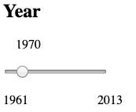

# Design

## Data
I have downloaded the data from [Kaggle](https://www.kaggle.com/dorbicycle/world-foodfeed-production) in a CSV file. I converted this into a JSON file. This data comes from the Food and Agriculture Organization of the United Nations.
The data shows, per country:
- what kinds of food are produced
- whether this food is actually food (for humans) or feed (for livestock)
- the amount produced per year (in 1000 tonnes) from 1961 to 2013

## Components
First of all a world map will be displayed portraying the amount of overall food produced per country, this amount will be calculated by adding up the production amounts of each food per country.
I will use a palettescale for the colors. Light green will mean low production whereas dark green will mean high production. When the user hovers over a certain country, a little popup will display the country's name and overall production.
To implement this I will need [datamaps](https://github.com/markmarkoh/datamaps), d3v3 and the d3-tip.

When the user clicks on a certain country, a pie chart appears showing the distribution of food versus feed. When hovering over a side of the piechart, a popup will display the percentage of food or feed. I will implement this using d3v5 and the d3-tip.

When the user clicks on a part of the pie chart, a bar chart appears displaying all the food (or feed) items and how much of each is produced. When hovering over a bar, a popup will display the amount of that food produced. I will implement this using d3v5 and the d3-tip.

Furthermore, there will also be a dropdown button to change the year. I have data from 1961 until 2013.

As a second interactive element I would like to implement a header on top of the page with several buttons for different pages. There will be a page containing the introduction, where the problem is explained. And a page containing the visualizations. Perhaps there will also be a page discussing individual contribution, or what one can do to decrease consumption.  
This will be implemented using bootstrap.

## Overview

## Code
Each graph will have its own javascript file:
- map.js
- pie.js
- bar.js
Furthermore I will have a main.js, a project.html and a project.css file.
Since there is so much data, the data will be split up in one json file per country as the pie chart and the bar chart only need data for one country. This will speed up the updating of the charts since less data is loaded accordingly.
For the world map I will create a json file with the countries' names and total production amount per year.
These files will be in the folder data.
