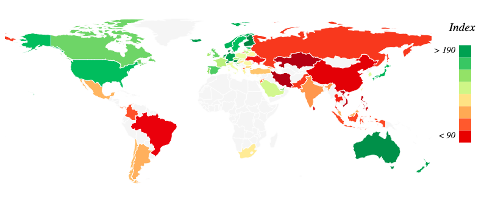
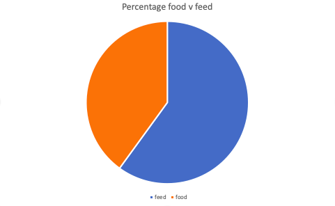
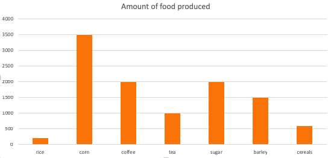

# Design

## Data
I have downloaded the data from [Kaggle](https://www.kaggle.com/dorbicycle/world-foodfeed-production) in a CSV file. I converted this into a JSON file. This data comes from the Food and Agriculture Organization of the United Nations.
The data shows, per country:
- what kinds of food are produced
- whether this food is actually food (for humans) or feed (for livestock)
- the amount produced per year (in 1000 tonnes) from 1961 to 2013

## Components
First of all a world map will be displayed portraying the amount of overall food produced per country, this amount will be calculated by adding up the production amounts of each food per country.
Light green will mean low production whereas dark green will mean high production. When the user hovers over a certain country, a little popup will display the country's name and overall production.
To implement this I will need [datamaps](https://github.com/markmarkoh/datamaps).

When the user clicks on a certain country, a pie chart appears showing the distribution of food versus feed.

When the user clicks on a part of the pie chart, a bar chart appears displaying all the food (or feed) items and how much of each is produced.

