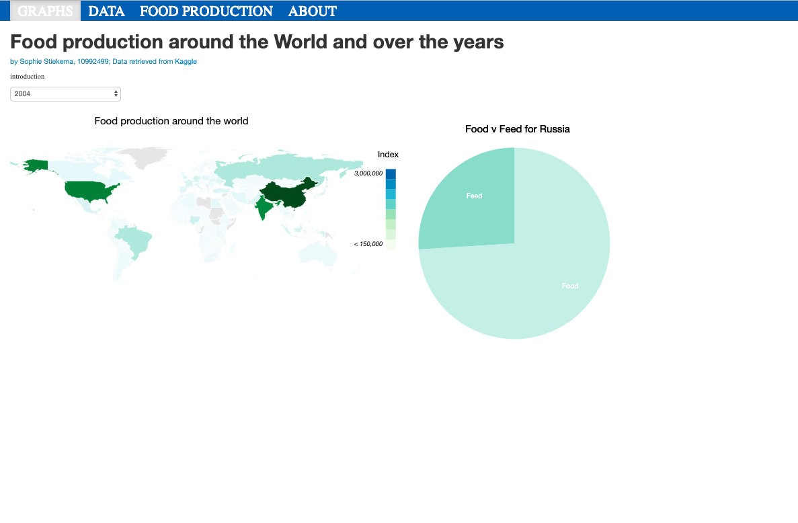

# Process Book

## Day 1
I downloaded the data and decided to convert it into a JSON file. I had to decide which columns to keep and which to discard, I dropped the area code, area, item code, element code, unit, latitude, and longitude. The information contained in these columns wasn't relevant for my visualization.  

## Day 2
I had my first mentor meeting today. I decided to split up the data since the file is so big. I will have a JSON file for each country as the bar chart and pie chart only need data for one country. For the world map I will make a JSON file that contains all countries and the total food produced in each year.
I have also decided that for the years I will start with a dropdown button instead of a slider since a slider would load a lot of data while sliding whereas it will be quicker to just click on a year as that will only load the data for that specific year.

## Day 3
We had our first stand-up meeting this morning. My team mates thought my idea was clear. They did say a slider would be nicer than a dropdown for the years as a dropdown of 50 years would be very long. So I might start with a selection of 10 years. I also asked them for advice on my data format. I need to change the JSON files, right now they are ordered per food item and then per year, I would like them to be ordered per year and then per food item.
I have not been able to change the strucure but I have made a new file that contains total production per country per year. This loads into my map!

## Day 4
Today we started off with our standup meeting. Everyone made a to-do list. I still have to write the code for my barchart. And then add the buttons. I also have to make the graphs interactive, so that they can load a data file for each country. Today I wrote the code for the barchart. I am still hardcoding the opening of the countries' data file, but it is looking good. Moreover, I tried calling the function barchart from my main file but that gave me an error, so right now I am calling the barchart function when the page loads.

## Day 5
My group gave me the advice to change the orientation of my barchart. It would be better to put the type of food on the y axis, as that would be easier to read. Furthermore, maybe I should change the color scheme as right now a specfic type of food seems to be linked to a country if the color is the same. I also got the advice to add a button to change the order of the data within the barchart. So perhaps ascending, descending and alphabetical.

## Day 6
I was able to link the piechart to the barchart. Now when you click on a country just the piechart appears, and then when clicking on one part of the piechart, the bargraph appears.
I also changed the color scheme, I wanted to use colors similar to those of crops.  
Furthemore, I added bootstrap to have a navugation bar at the top.

## Day 7
Today I implemented a dropdown to change years. In the beginning some years did not work with the paletteScale for the fillcolor, this was because a minimum and maximum value was not calculated from the values, this was because there were still undefined values in the array. After removing those it worked. The dropdown now works and when a new year is selected, everything is reset.

There is just an issue with the standard option:

## Day 8
Today I changed the layout of my page so everything is easier to read.

I also added a new gradient legend!
We discussed our style.

## Day 9
Today I got as feedback that I should put my x axis of my barchart at the top, so I changed that. I also changed the hover opacity for each graph. Furthermore I centered the piechart & barhraph. I wanted them side by side but they are too big to fit and I do not want to reduce their size as that would make them less comprehensible.

