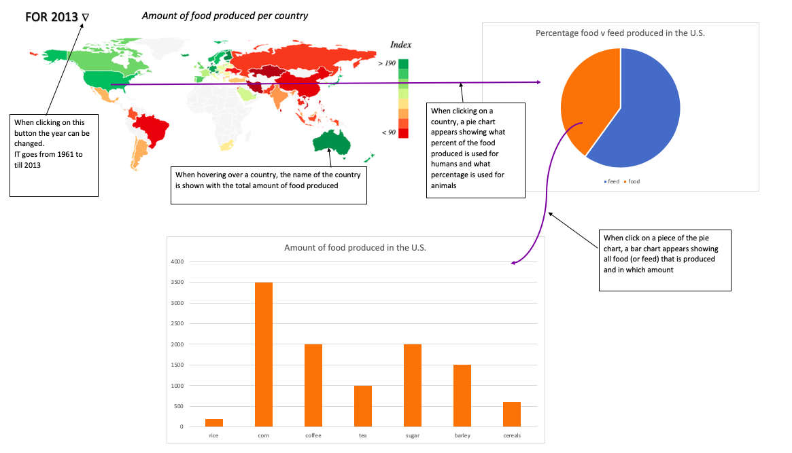
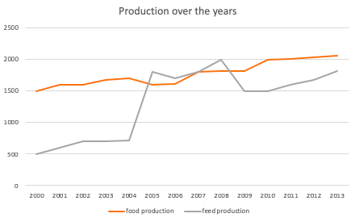
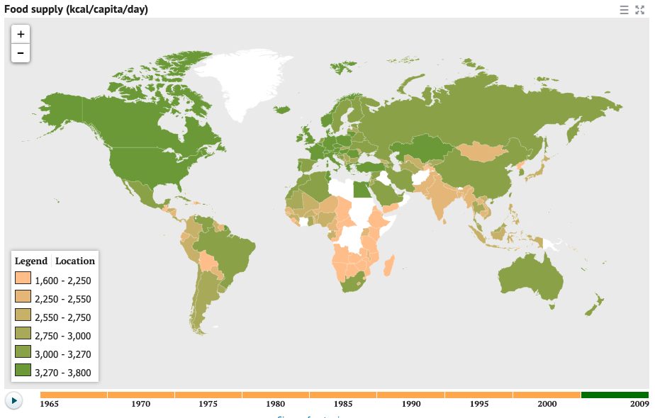
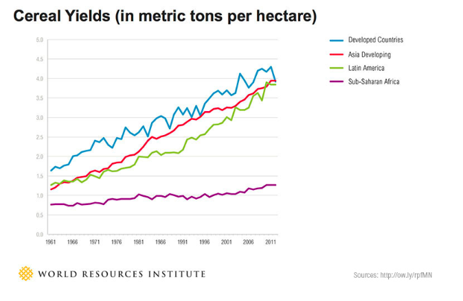
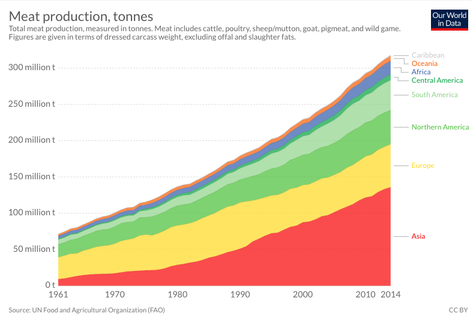

# Eind Project
Sophie Stiekema - 10992499
## Problem Statement
The world population keeps on growing, in 2050 it is expected to rise to 9.7 billion.
Food is finite and its production has a huge impact on the environment. Production efficiency is key in this regard.
Not only do many countries produce food for their citizens, but also for their livestock:
feed. It would be interesting to see which countries produce the most food in general, and also which countries produce the most feed. Perhaps focusing more on the production of food, instead of feed, could increase the availability of overall food for humans and decrease overall production and thus the environmental impact.

## Visualization
It would be interesting to compare countries in their food production and see where this food goes. Furthermore, this project will give insight in the various types of food produced by each country.

My visualization will include:
- a world map ranking each country per amount of food produced (maybe per capita?) [MVP]
- a pie chart showing the % of food (for humans) v the % of feed (for livestock) [MVP]
- a bar chart showing the types of food produced in each category and country [MVP]
- a dropdown menu  to change the year (other interactive component)
- a button to choose a random country and year (other interactive component)

This visualization will be aimed at people who would like to know more about global food production around the world, but also specific production per country.

Although perhaps it is more interesting to see how total food production changed over the years

## Data
I will download data from [Kaggle](https://www.kaggle.com/dorbicycle/world-foodfeed-production). This data comes from the Food and Agriculture Organization of the United Nations.
The data comes in a csv file. I might have to convert this into a JSON file.

## External Components
- d3 v3 & v5, d3-tip
- datamaps

## Similar Visualizations
There are some nice visualizations out there but non really show the global production like I would like to.
This beautiful visuallization from [Visual Capitalist](https://www.visualcapitalist.com/visualizing-rapidly-changing-global-diet/) shows how rapidly diets are changing, and also makes predictions for the future.
This one also shows food intake over the years around the world
\
This one shows the increase in cereal production per region over the years

This one shows meat production per region over the years

## Challenges
I think a big challenge is conveying the data in a simple and comprehensive matter.
There is so much data, and many different things can be said so it is important to choose a message and tell it well.
Furthermore it will be challenging to initialize and link all the graphs together and make sure that everything is aesthetically pleasing.
