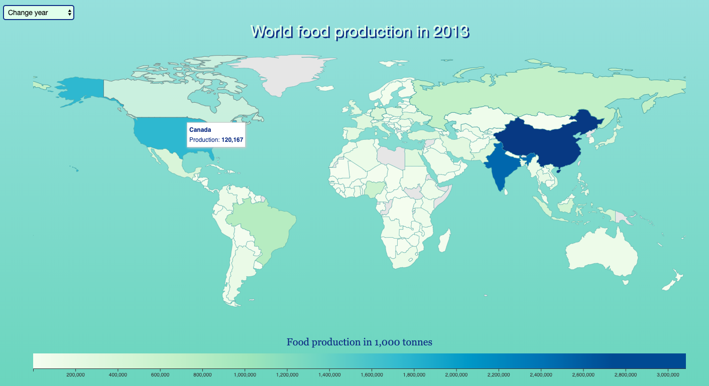
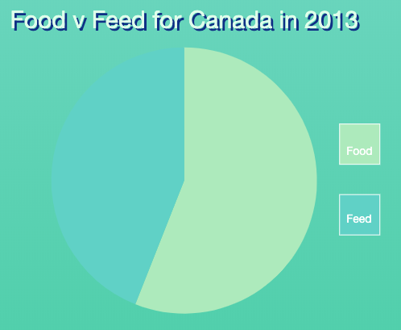
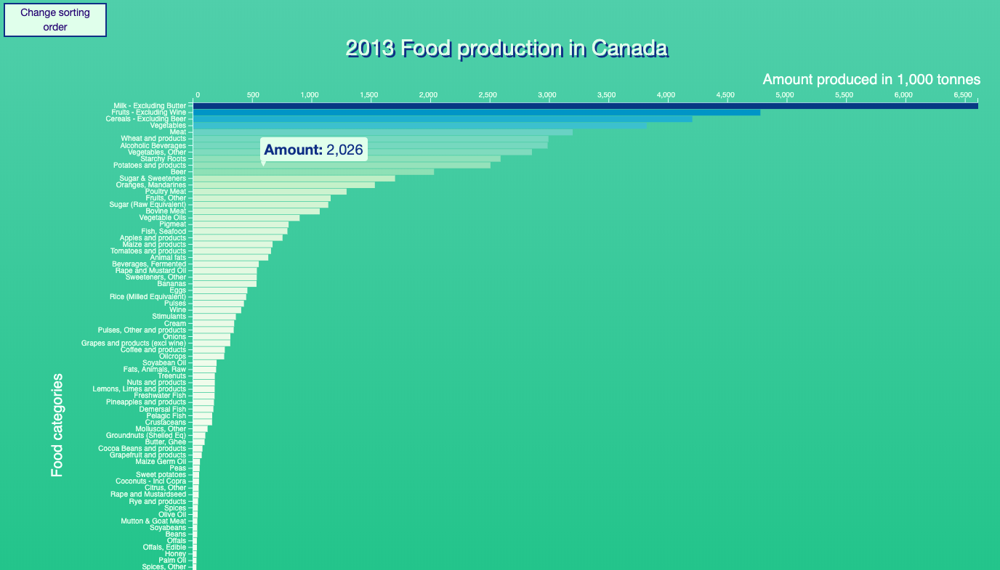

# [Food production around the World and over the years](https://sophieclaire.github.io/project/code/HTML/index.html)

The world population keeps on growing, in 2050 it is expected to rise to 9.7 billion.
Food is finite and its production has a huge impact on the environment. Production efficiency is key in this regard.
Not only do many countries produce food for their citizens, but also for their livestock: feed.
This visualization shows how much food each country produces and which percentage of this goes to humans (actual food), and which percentage goes to animals (feed).
It includes a world map showing a country's total food plus feed production. There is also a button to change the year.

A piechart showing the distribution of food vs feed for that country.

A barchart showing the food or feed elements produced in that country. This includes a button to change the sorting order of the barchart.

## External Sources
I have used the following websites for inspiration:
- [Tip](https://github.com/Caged/d3-tip)
- [Datamaps](https://github.com/markmarkoh/datamaps)
- [Gradient Legend](https://observablehq.com/@tmcw/d3-scalesequential-continuous-color-legend-example)
- [Piechart](http://www.cagrimmett.com/til/2016/08/19/d3-pie-chart.html)
- [Piechart transition](https://www.d3-graph-gallery.com/graph/pie_changeData.html)
- [Barchart](https://bl.ocks.org/caravinden/eb0e5a2b38c8815919290fa838c6b63b)
- [Barchart](https://alignedleft.com/tutorials/d3/)
- [Barchart tip](http://bl.ocks.org/Caged/6476579)

## Author
Sophie Claire Stiekema

## License
Copyright © 2019, Sophie Claire Stiekema. Universiteit van Amsterdam.
