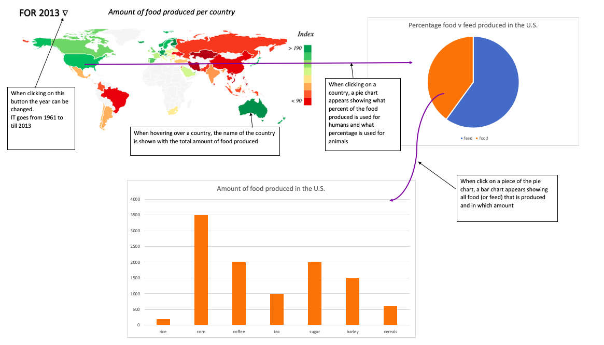

# EindProject

The world population keeps on growing, in 2050 it is expected to rise to 9.7 billion.
Food is finite and its production has a huge impact on the environment. Production efficiency is key in this regard.
Not only do many countries produce food for their citizens, but also for their livestock:
feed.

It would be interesting to compare countries in their food production and see where this food goes. Furthermore, this project will give insight in the various types of food produced by each country.

My visualization will include:
- a world map ranking each country per amount of food produced (maybe per capita?) [MVP]
- a pie chart showing the % of food (for humans) v the % of feed (for livestock) [MVP]
- a bar chart showing the types of food produced in each category and country [MVP]
- a button to change the year (optional)

I will be using data from https://www.kaggle.com/dorbicycle/world-foodfeed-production
