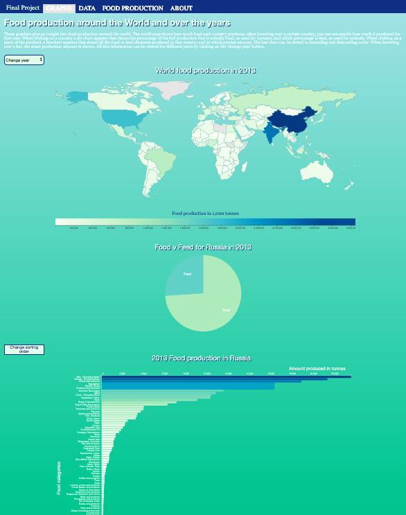

# Final Report

## Description
My data visualization starts with a world map showing how much food each country produces in the year 2013. A darker color means a higher production. When clicking on a country a piechart appears showing what percentage of the food produced is actually used for humans (food), and which percentage is used for animals (feed). The user can then click on one of the two slices of the pie and a barchart will appear showing the exact amount of each food or feed element produced by that country in that year. The bar chart can be sorted in ascending or descending order. The year can be changed via a dropdown button at the top of the page.

## Technical Design
Clearly describe the technical design: how is the functionality implemented in your code? This should be like your DESIGN.md but updated to reflect the final application.

First, give a high level overview, which helps us navigate and understand the total of your code (which components are there?). Second, go into detail, and describe the modules/classes (apps) files/functions (data) and how they relate.

All data files are contained within the data folder. All pictures are contained in the doc folder.

There are 3 HTML files, one for each page.
The most important one is the linked.html file, this one displays all the visualization.

I also have several JS files, one for each graph.

### main.js
The main.js file sets the initial year (2013). It contains two functions. One that updates the data for each year when the dropdown button is used. And one that fetches the data and calls the transformation function and then the function that draws the worldmap.

### map.js
The map.js file contains two functions. One that prepares the data for the world map, this function pairs up countries from the world map dataset with countries from my food production dataset. It also creates a palette scale with a sequential color scale. The other function draws the worldmap and calls the function that draws its legend.

### maplegend.js
The maplegend.js file contains just one function that draws the legend for the worldmap. It creates horizontal gradient bar with an x-axis to explain what the colors of the worldmap mean.

### piechart.js
The piechart.js file draws the piechart when the user clicks on a country in the worldmap. This file contains four functions. One that is called in the map.js file and fetches the data for the specific country

## Challenges
Clearly describe challenges that your have met during development. Document all important changes that your have made with regard to your design document (from the PROCESS.md). Here, we can see how much you have learned in the past month.

Defend your decisions by writing an argument of a most a single paragraph. Why was it good to do it different than you thought before? Are there trade-offs for your current solution? In an ideal world, given much more time, would you choose another solution?
